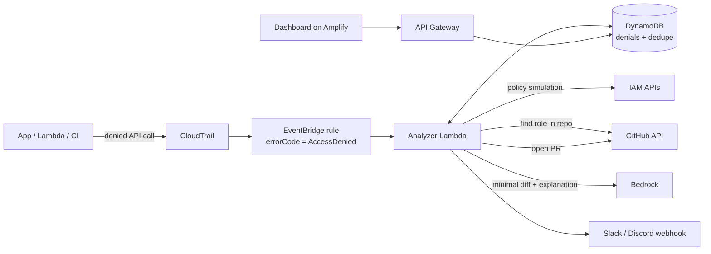

# WhyDenied

**Turn an AWS `AccessDenied` into a reviewed pull request against your infrastructure code.**

Built for [First Commit](https://www.wemakedevs.org/aws/first-commit) (WeMakeDevs × AWS, 17–20 September 2026).

---

## The problem

Every team building on AWS hits this:

```
User: arn:aws:sts::123456789012:assumed-role/orders-api-role/orders-api
is not authorized to perform: s3:GetObject on resource: arn:aws:s3:::invoices/...
```

Then someone loses an hour working out which policy is responsible: the identity policy, a resource policy, a permissions boundary, or an SCP. Even after finding the missing permission, the fix still has to go somewhere:

- **Fixed by hand in the console:** the live role no longer matches the Terraform code, and the next `terraform apply` quietly reverts the fix.
- **Fixed with `"Action": "*"` to make it go away:** the role now has far more access than it needs.
- **Fixed properly:** someone has to find the file that defines the role, edit it, open a PR and wait for review. That's slow, so it rarely happens.

The errors also come from places nobody is watching, such as Lambda logs, CI runs and cron jobs, so the same one repeats hundreds of times before anyone notices.

## What WhyDenied does

1. **Catches** `AccessDenied` / `UnauthorizedOperation` events from CloudTrail as they happen (through EventBridge).
2. **Groups** duplicates: 500 identical errors become one issue with a count.
3. **Explains** which policy type blocked the request and which action is missing.
4. **Finds** the Terraform file that defines the role.
5. **Opens a pull request** with the smallest change that fixes it (never `*`) and a plain-English explanation.
6. **Notifies** your team on Slack or Discord and shows everything on a dashboard.

A person still reviews and merges the PR. WhyDenied never changes IAM directly.

## Why not an existing tool?

| Tool | What it does | What's missing |
|---|---|---|
| [Access Undenied](https://github.com/tenable/access-undenied-aws) (open source) | Explains CloudTrail AccessDenied events and suggests a least-privilege policy | CLI you run by hand; outputs JSON, doesn't touch your code |
| [Diagnose with Amazon Q](https://docs.aws.amazon.com/amazonq/latest/qdeveloper-ug/diagnose-console-errors.html) | Explains errors in the AWS console | Console only: doesn't see errors from Lambda, CI or scripts; keeps no history |
| [IAM Policy Autopilot](https://aws.amazon.com/blogs/security/iam-policy-autopilot-an-open-source-tool-that-brings-iam-policy-expertise-to-builders-and-ai-coding-assistants) (AWS) | Generates policies from code for AI assistants; troubleshoots denials while you test | Works on your laptop while you code, not on errors already happening in AWS |
| [AWSSupport-TroubleshootIAMAccessDeniedEvents](https://docs.aws.amazon.com/systems-manager-automation-runbooks/latest/userguide/awssupport-troubleshootiamaccessdeniedevents.html) | SSM runbook that queries recent denials | Run by hand; produces a report, not a fix |

**The gap:** all of these stop at *"here is the policy you need"*. WhyDenied continues to *"here is the PR that adds it to your Terraform"*, and it runs all the time instead of only when someone asks.

## How it works



## Tech stack

| Part | What it uses |
|---|---|
| Catch denials | CloudTrail, EventBridge |
| Analysis | AWS Lambda (Python), IAM policy simulator, `GetAccountAuthorizationDetails` |
| Store and group | DynamoDB |
| Write the fix | Amazon Bedrock (Claude) |
| Deliver the fix | GitHub (PRs), Slack and Discord webhooks |
| Dashboard | React on AWS Amplify, API Gateway |
| Deploy WhyDenied itself | AWS SAM |
| Demo target | Sample Terraform app with a deliberately missing permission |

## Scope (hackathon version)

**In scope**
- Terraform, for IAM roles with an explicit `name`
- Identity-based policies (the missing-`Allow` case)
- One AWS account, one GitHub repo

**Out of scope (said openly)**
- SCPs, session policies, VPC endpoint policies, resource policies
- CDK / CloudFormation
- Multiple accounts and AWS Organizations

## Status

🚧 In progress. See [docs/PLAN.md](docs/PLAN.md).

## Credits

Anything third-party that this project uses will be listed here with its licence, as the hackathon rules require.
