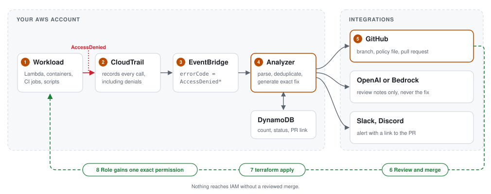

# WhyDenied

**Turn AWS `AccessDenied` errors into reviewed pull requests against your Terraform.**

WhyDenied watches CloudTrail for denied API calls, works out which IAM role is missing which permission, and opens a pull request that grants exactly that permission on exactly that resource. A reviewer approves the change; WhyDenied never modifies IAM directly.

Built for [First Commit](https://www.wemakedevs.org/aws/first-commit), the WeMakeDevs × AWS hackathon (17 to 20 September 2026).

Example: [the pull request WhyDenied opened for the demo app](https://github.com/tusharkhatriofficial/whydenied-demo-infra/pull/1).

---

## Why

Least privilege is the standard for IAM, and it is rarely maintained in practice. Every new feature, renamed resource or environment difference can surface a new `AccessDenied`. Each one costs an engineer time to trace the failing call to a policy, find the Terraform that defines the role, and open a change. Under time pressure the fix often becomes a console edit that drifts from code, or a wildcard such as `"Action": "*"`.

WhyDenied removes that work. Roles can start with minimal permissions and grow one reviewed, exact permission at a time.

## How it works

<p align="center"></p>

1. **Capture.** An EventBridge rule receives every `AccessDenied` and `UnauthorizedOperation` event from CloudTrail, including read-only calls, which EventBridge excludes by default.
2. **Parse.** The analyzer extracts the IAM role (not the temporary session), the action, the resource and the denial reason.
3. **Deduplicate.** Each (role, action, resource) is stored once in DynamoDB with an occurrence count. Only the first occurrence triggers a fix.
4. **Fix.** The analyzer finds the `aws_iam_role` in your Terraform repository and opens a pull request that adds an inline policy for the denied action and resource.
5. **Review.** An optional AI model summarises the denial for the reviewer: whether the access looks expected, the risk of granting it, and what to verify.
6. **Notify.** An alert with a link to the pull request is posted to Slack and/or Discord.

## Safety model

- **The fix is generated by code, not by AI.** The model only writes review notes, so an incorrect or manipulated response cannot widen permissions.
- **Exact scope.** Each fix grants one action on one resource. Wildcard actions are refused.
- **Only missing `Allow` statements are fixed automatically.** Explicit denies, SCPs, permissions boundaries and session policies are reported for a human to handle.
- **Human approval.** Changes arrive as pull requests. Nothing is applied without a merge.
- **Untrusted input.** Event data is passed to the model as delimited data, and model output is validated and stripped of markup before it reaches a pull request.
- **Least privilege for WhyDenied itself.** The analyzer can read only SSM parameters under `/whydenied/` and write only to its own table.

## Comparison

| Tool | Scope | WhyDenied adds |
|---|---|---|
| [Access Undenied](https://github.com/tenable/access-undenied-aws) | CLI that explains CloudTrail denials and suggests a policy | Runs continuously and delivers the fix as a pull request |
| [Diagnose with Amazon Q](https://docs.aws.amazon.com/amazonq/latest/qdeveloper-ug/diagnose-console-errors.html) | Explains errors raised in the AWS console | Covers denials from Lambda, CI and scripts, with history |
| [IAM Policy Autopilot](https://aws.amazon.com/blogs/security/iam-policy-autopilot-an-open-source-tool-that-brings-iam-policy-expertise-to-builders-and-ai-coding-assistants) | Generates policies from source code during development | Responds to denials that occur in running environments |

## Getting started

WhyDenied is self-hosted. It runs in your AWS account, and your CloudTrail data, IAM details and tokens stay there.

### Prerequisites

- A CloudTrail trail recording management events (read and write) in the target region
- Infrastructure defined in Terraform in a GitHub repository, with IAM roles declared using an explicit `name`
- [AWS SAM CLI](https://docs.aws.amazon.com/serverless-application-model/latest/developerguide/install-sam-cli.html) and Python 3.14

### 1. Deploy

```bash
git clone https://github.com/tusharkhatriofficial/whydenied.git
cd whydenied
sam build
sam deploy --guided --parameter-overrides GitHubRepo=<owner>/<terraform-repo>
```

### 2. Add a GitHub token

Create a [fine-grained personal access token](https://github.com/settings/personal-access-tokens/new) scoped to your Terraform repository with **Contents** and **Pull requests** set to read and write. Store it as a SecureString:

```bash
aws ssm put-parameter --type SecureString \
  --name /whydenied/github-token --value '<token>'
```

### 3. Optional: AI review and alerts

```bash
# AI review notes via OpenAI (or deploy with AIProvider=bedrock and skip this)
aws ssm put-parameter --type SecureString --name /whydenied/openai-api-key --value '<key>'

# Alerts
aws ssm put-parameter --type SecureString --name /whydenied/slack-webhook   --value '<webhook-url>'
aws ssm put-parameter --type SecureString --name /whydenied/discord-webhook --value '<webhook-url>'
```

Any parameter that does not exist is skipped.

### 4. Verify

Trigger a denial from a role defined in your repository. Within about 30 seconds a pull request titled `WhyDenied: allow <action> for <role>` appears. The [demo repository](https://github.com/tusharkhatriofficial/whydenied-demo-infra) contains a ready-made example.

## Configuration

**Stack parameters**

| Parameter | Default | Description |
|---|---|---|
| `GitHubRepo` | | Terraform repository that receives fix pull requests (`owner/name`) |
| `AIProvider` | `openai` | `openai`, `bedrock` or `none` |
| `OpenAIModel` | `gpt-5-mini` | Model used when `AIProvider=openai` |
| `BedrockModel` | `us.anthropic.claude-haiku-4-5-20251001-v1:0` | Model or inference profile used when `AIProvider=bedrock` |

**SSM parameters** (SecureString)

| Name | Required | Purpose |
|---|---|---|
| `/whydenied/github-token` | Yes | Create branches and pull requests |
| `/whydenied/openai-api-key` | With `AIProvider=openai` | AI review notes |
| `/whydenied/slack-webhook` | No | Slack alerts |
| `/whydenied/discord-webhook` | No | Discord alerts |

**Denial status** (stored in the `whydenied-denials` table)

| Status | Meaning |
|---|---|
| `pr_open` | Fix pull request opened |
| `needs_human` | Not safe to fix automatically, such as an explicit deny or SCP |
| `role_not_found` | No matching `aws_iam_role` in the repository |
| `not_a_role` | Caller is the root user or an IAM user; recorded only |
| `error` | Opening the fix failed; details in `note` |

## Limitations

- **Management events only.** Data events such as S3 `GetObject` or DynamoDB `GetItem` require CloudTrail data event logging, which is billed separately.
- **One region, one account and one repository per deployment.**
- **Terraform only,** with roles matched by an explicit `name`. CloudFormation and CDK are not yet supported.
- **Identity-based policies only.** Resource policies, boundaries, SCPs and session policies are reported, not fixed.

## Project structure

```
template.yaml            SAM stack: EventBridge rule, Lambda, DynamoDB table
src/analyzer/
  app.py                 Lambda handler: record, deduplicate, fix, notify
  parse.py               CloudTrail event to denial
  terraform.py           Locate the role and render the policy
  fixer.py               Branch, commit and pull request
  github.py              Minimal GitHub REST client
  explain.py             AI review notes (OpenAI or Bedrock)
  notify.py              Slack and Discord payloads
tests/                   Unit tests, including real captured CloudTrail events
```

## Development

```bash
python3 -m venv .venv && .venv/bin/pip install pytest boto3
.venv/bin/python -m pytest
```

---

`#FirstCommit` `#WeMakeDevs` `#AWS` `#BuildOnAWS`
